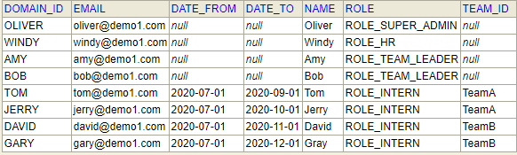
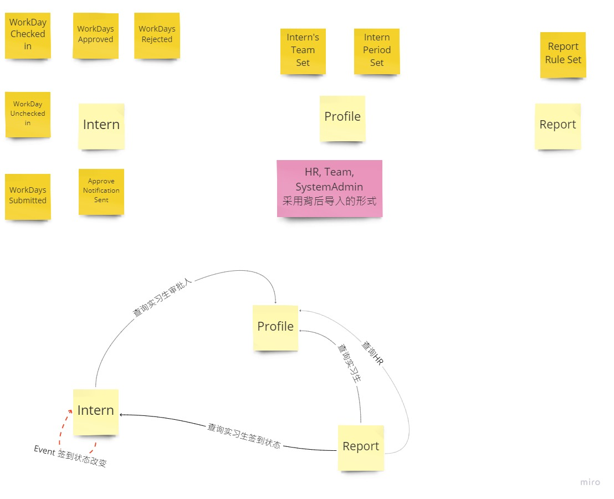
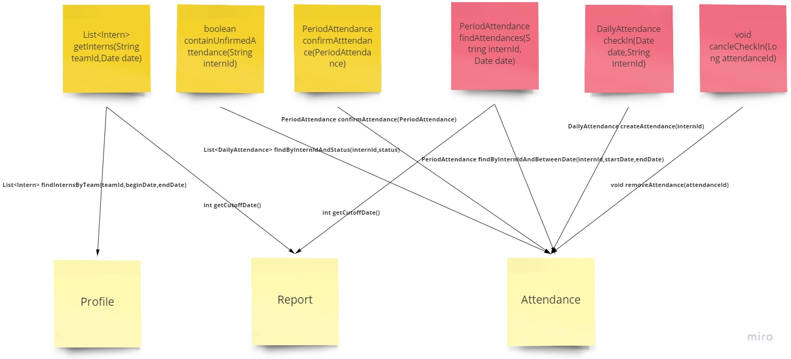

Intern Management System
---
###Make the project running & Sign in
>1) Run: 
>Run com.demo.workshop.intern.InternApplication 
>
>2) Sign in:
>Following initialized data was auto loaded during system startup.

>You can sign in system with user-id and default password: 123456
---
###UI Operation
>1) Manager: Manager can view, create and update all interns' information. 
>
>2) Team leader: Team leader can approve or reject the sign-in records of interns who belongs to the leader's department.
>
>3) Intern: Interns can complete their check-in today or earlier.
---
###System Event
>1) Daily Check-in Reminder:
>If today is workday but  intern has not checked in by 4:00.pm, System will send email to remind her/he to check in.
>
>2) Period Attendance Reporter: 
>If today is within three days after the settlement date, which is define By rule, the system will send an attendance 
>report email to HRs and team leaders, and copy to manager on 8:45.am.

---
###Our DDD Flow
>During eventStorming workshop, we listed all domain events and group them to three domains:

>Then we break down requirement to API level(API First)
>
