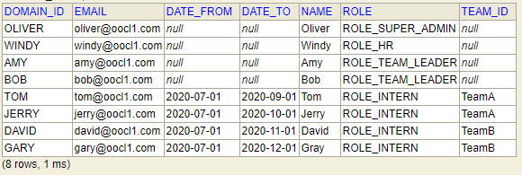

#Intern Intern Management System
---
###Make the project running & Sign in
>1、Run it: 
>Run com.demo.workshop.intern.InternApplication 
>
>2、Sign in with inital data:
>When the system starts, we provide the following data for initialization.

>You can sign in system with domain_id and default Password: 123456
---
###UI Operation
>1、Mananger：The mananger can view, create and update all interns' information. 
>
>2、HR: A HR can view all interns' information. 
>
>3、Team leader：A Team leader can approve or reject the sign-in records of interns who belongs to the leader's department.
>
>4、Intern：Interns can complete their check-in today or earlier.
---
###System Event
>1、Daily Check In Reminder:
>If today is workDay and the intern has not checked in by 4:00.pm, System will send an email to reminder he to check In.
>
>2、Period Attendance Reporter：
>If today is within three days after the settlement date, which is define By rule, the system will send an attenance 
>report email to HRs and Team Leaders, and Copy to Mananger on 8:45.am.

